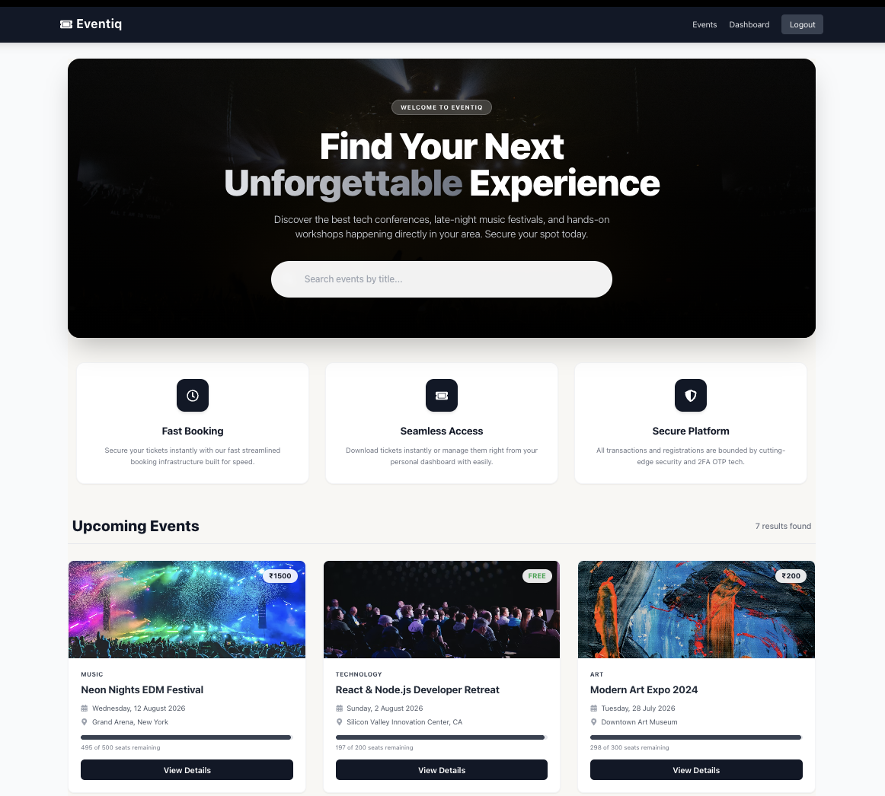
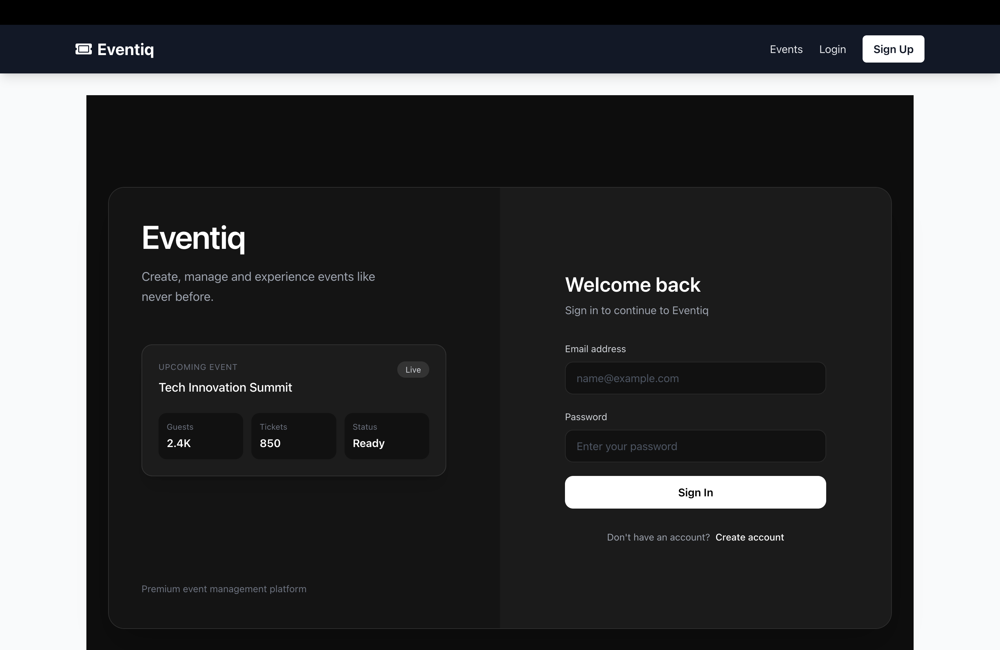
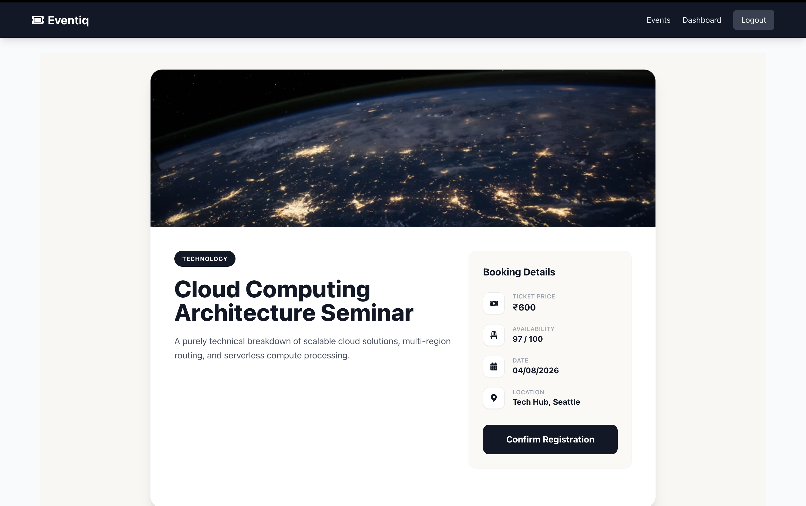
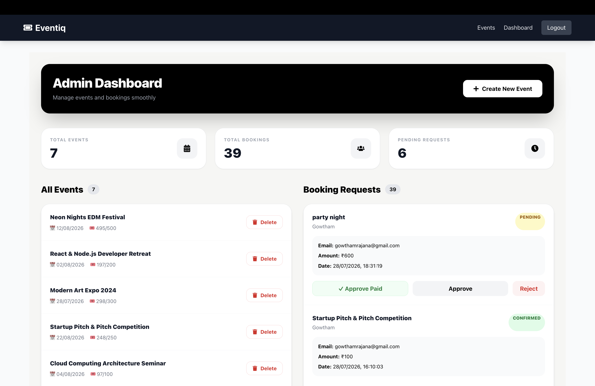

# Eventiq - Full Stack MERN Event Booking Platform

Eventiq is a full-stack event booking platform built using the MERN stack. It allows users to discover events, register, verify accounts using OTP authentication, and book events. It also provides an admin dashboard for managing events and bookings.

## 🚀 Live Demo

https://eventiq-six.vercel.app/ 


## ✨ Features

## User Features

- User registration
- Email OTP verification
- Secure login authentication
- JWT-based authentication
- Browse available events
- Search and filter events
- View event details
- Book events
- View booking history
- User dashboard


## Admin Features

- Admin dashboard
- Create new events
- Manage events
- View bookings
- Manage event availability


# 🛠️ Tech Stack

## Frontend

- React.js
- Vite
- React Router DOM
- Axios
- CSS3


## Backend

- Node.js
- Express.js
- REST APIs
- JWT Authentication
- Brevo HTTP API


## Database

- MongoDB
- Mongoose
- MongoDB Atlas


## Deployment

- Frontend: Vercel
- Backend: Render
- Database: MongoDB Atlas


# ⭐ Key Highlights

- Full-stack MERN application
- Secure authentication using JWT
- OTP-based email verification
- Password encryption using bcrypt
- Role-based access control for users and admins
- RESTful API architecture
- Cloud deployment using Vercel, Render, and MongoDB Atlas


# 🏗️ Architecture

```
User
 |
 |
React Frontend (Vercel)
 |
 |
Node.js + Express Backend (Render)
 |
 |
MongoDB Atlas Database
```


# 📂 Project Structure

```
Eventiq
|
|-- client        # React frontend
|
|-- server        # Node.js backend
|
|-- docs          # Project documentation
|
|-- README.md
```


# ⚙️ Installation and Setup

## Clone Repository

```bash
git clone https://github.com/gowthamrajana/Eventiq.git
```


## Backend Setup

Navigate to server folder:

```bash
cd server
```

Install dependencies:

```bash
npm install
```

Create a `.env` file inside the server folder:

```
MONGO_URI=your_mongodb_connection_string
JWT_SECRET=your_secret_key
EMAIL_USER=your_email
BREVO_API_KEY=your_API_KEY
```

Run backend:

```bash
npm run dev
```


## Frontend Setup

Navigate to client folder:

```bash
cd client
```

Install dependencies:

```bash
npm install
```

Run frontend:

```bash
npm run dev
```


# 🗄️ Database

MongoDB Atlas is used as the production database.

Collections:

- Users
- Events
- Bookings


# 🔐 Security

Implemented:

- Password hashing using bcrypt
- JWT authentication
- Protected routes
- Role-based authorization
- OTP email verification


# 🌐 Deployment

Frontend:
Vercel

Backend:
Render

Database:
MongoDB Atlas


# 📸 Screenshots

## Home Page



## Login Page



## Event Details



## Admin Dashboard




# 👨‍💻 Developer

Gowtham Rajana